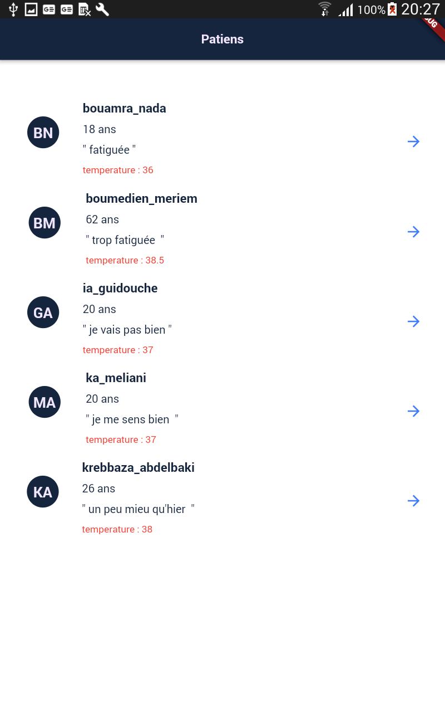
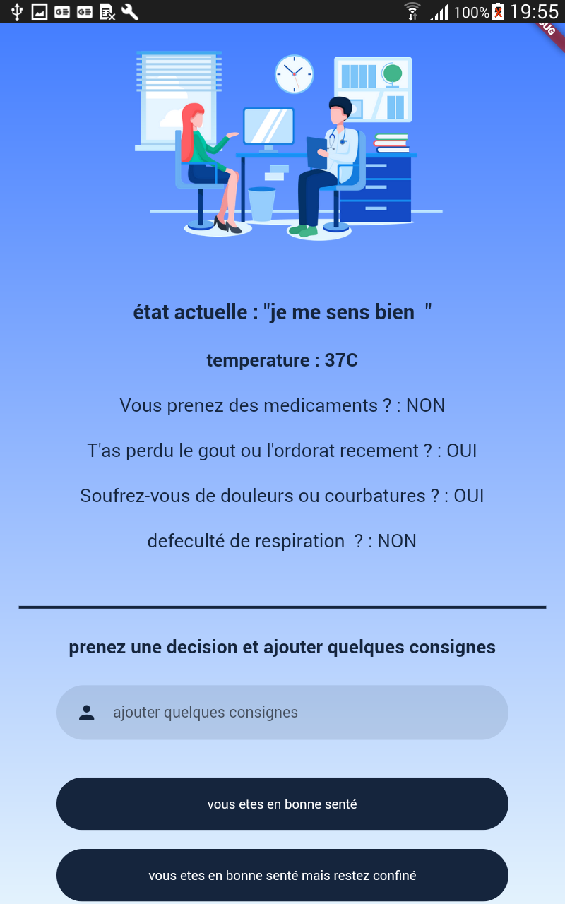
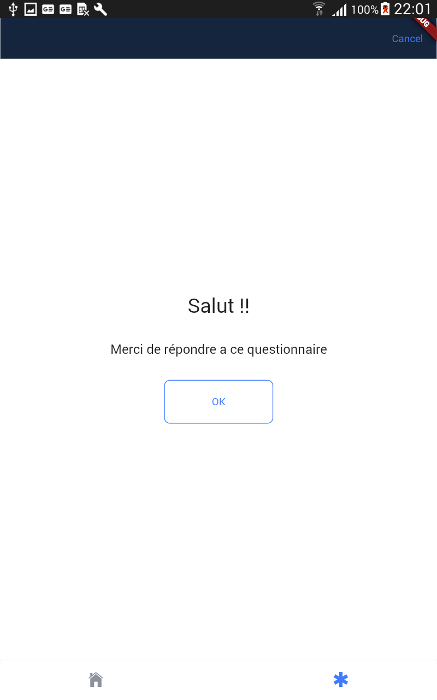
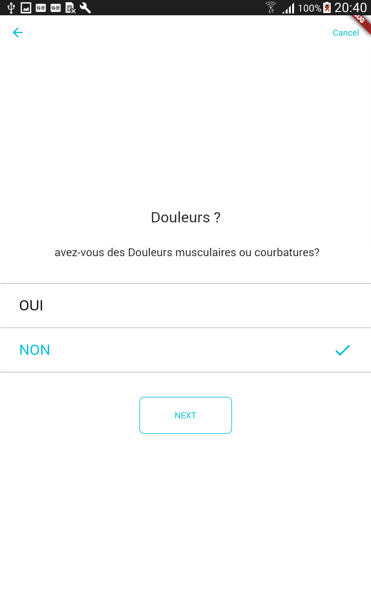
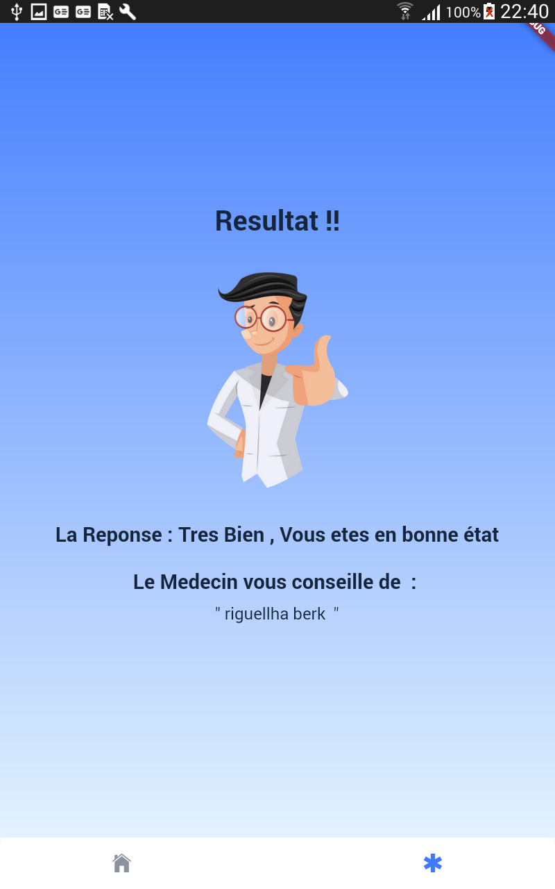

# Medom Proto

protoype

## c'est quoi ?
c'est une petite fonctionalité d'une application qui s'appelle medome , construite dans le cadre d'un mini projet 

 

  

  <h3 align="center">le logo de medom</h3>

### Screens

|Login screen|user interface|admin interface|
|:------------:|:------------:|:-------------:|
|||

|Page De Medecins|Page De Detaile|Questionnaire|
|:------------:|:------------:|:-------------:|
|||

|merci|courbatures ou douleures|resultat|
|:------------:|:------------:|:-------------:|
|||

<!-- ABOUT THE PROJECT -->
## About The Project
### comment ca marche ? 
reste a remplir 

### Built With

* [FLutter](https://flutter.dev/)
* [Firebase](https://firebase.google.com/)

