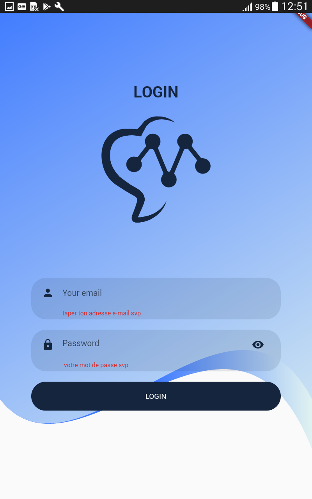
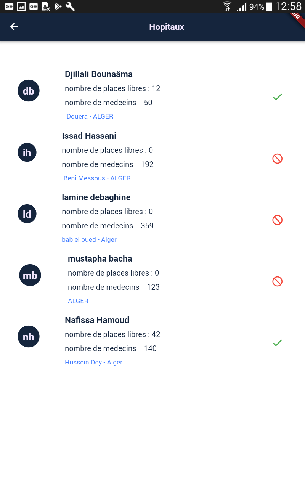
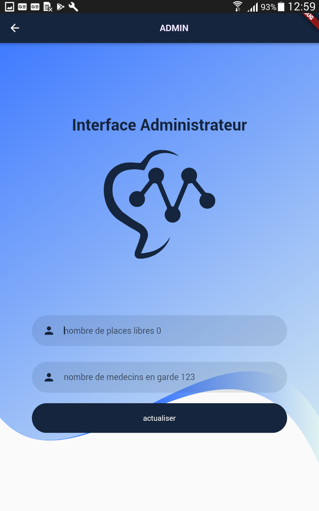

# Medom Proto

protoype

## c'est quoi ?
c'est une petite fonctionalité d'une application qui s'appelle medome , construite dans le cadre d'un mini projet 

 

  

  <h3 align="center">le logo de medom</h3>

  
<h2 style="display: inline-block">Table of Contents</h2>

  <ol>
    <li>
      <a href="#about-the-project">About The Project</a>
      <ul>
        <li><a href="#built-with">Built With</a></li>
      </ul>
    </li>
    <li>
    

  </ol>

### Screens

|Login screen|user interface|admin interface|
|:------------:|:------------:|:-------------:|
|||

<!-- ABOUT THE PROJECT -->
## About The Project
### comment ca marche ? 
reste a remplir 

### Built With

* [FLutter](https://flutter.dev/)
* [Firebase](https://firebase.google.com/)

